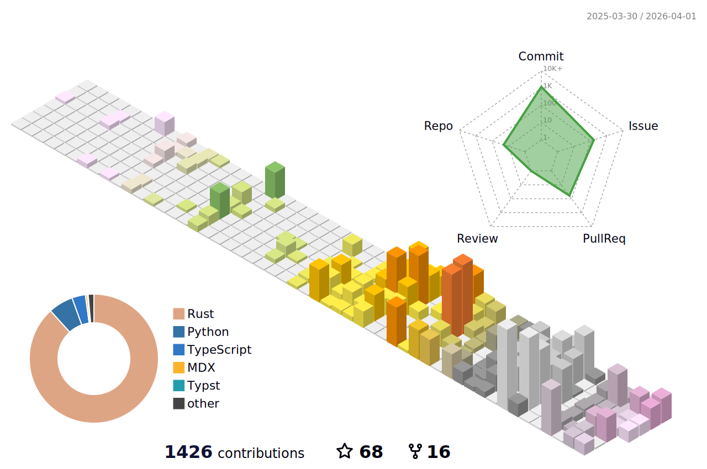

<details>
<summary>Click here for detailed stats!</summary>

<!--START_SECTION:waka-->


**🐱 My GitHub Data** 

> 📦 476.6 kB Used in GitHub's Storage 
 > 
> 🏆 607 Contributions in the Year 2025
 > 
> 🚫 Not Opted to Hire
 > 
> 📜 36 Public Repositories 
 > 
> 🔑 36 Private Repositories 
 > 
**I'm an Early 🐤** 

```text
🌞 Morning                1024 commits        ██░░░░░░░░░░░░░░░░░░░░░░░   09.35 % 
🌆 Daytime                4743 commits        ███████████░░░░░░░░░░░░░░   43.32 % 
🌃 Evening                2980 commits        ███████░░░░░░░░░░░░░░░░░░   27.22 % 
🌙 Night                  2201 commits        █████░░░░░░░░░░░░░░░░░░░░   20.10 % 
```


📊 **This Week I Spent My Time On** 

```text
💬 Programming Languages: 
Python                   7 hrs 59 mins       ███████░░░░░░░░░░░░░░░░░░   27.11 % 
Rust                     3 hrs 47 mins       ███░░░░░░░░░░░░░░░░░░░░░░   12.84 % 
CSV                      3 hrs 43 mins       ███░░░░░░░░░░░░░░░░░░░░░░   12.65 % 
Bash                     3 hrs 12 mins       ███░░░░░░░░░░░░░░░░░░░░░░   10.89 % 
TypeScript               3 hrs 10 mins       ███░░░░░░░░░░░░░░░░░░░░░░   10.79 % 

🔥 Editors: 
VS Code                  29 hrs 27 mins      █████████████████████████   99.91 % 
Obsidian                 1 min               ░░░░░░░░░░░░░░░░░░░░░░░░░   00.09 % 

💻 Operating System: 
Linux                    18 hrs 56 mins      ████████████████░░░░░░░░░   64.27 % 
WSL                      10 hrs 30 mins      █████████░░░░░░░░░░░░░░░░   35.65 % 
Mac                      1 min               ░░░░░░░░░░░░░░░░░░░░░░░░░   00.09 % 
```


<!--END_SECTION:waka-->
</details>
