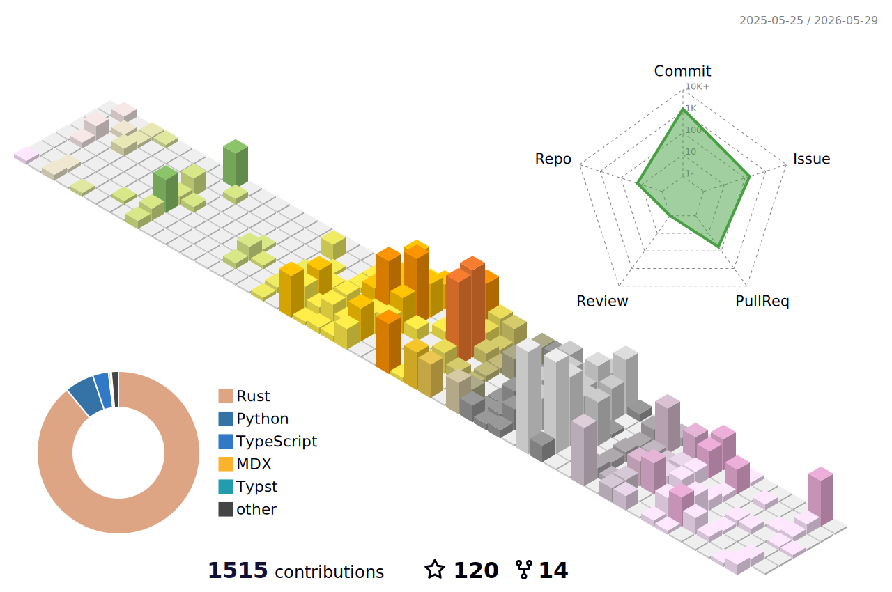

<details>
<summary>Click here for detailed stats!</summary>

<!--START_SECTION:waka-->


**🐱 My GitHub Data** 

> 📦 505.3 kB Used in GitHub's Storage 
 > 
> 🏆 767 Contributions in the Year 2026
 > 
> 🚫 Not Opted to Hire
 > 
> 📜 34 Public Repositories 
 > 
> 🔑 36 Private Repositories 
 > 
**I'm a Night 🦉** 

```text
🌞 Morning                805 commits         █░░░░░░░░░░░░░░░░░░░░░░░░   05.06 % 
🌆 Daytime                6664 commits        ██████████░░░░░░░░░░░░░░░   41.90 % 
🌃 Evening                5491 commits        █████████░░░░░░░░░░░░░░░░   34.53 % 
🌙 Night                  2944 commits        █████░░░░░░░░░░░░░░░░░░░░   18.51 % 
```


📊 **This Week I Spent My Time On** 

```text
💬 Programming Languages: 
Other                    17 hrs 19 mins      █████████████░░░░░░░░░░░░   53.50 % 
Rust                     6 hrs 7 mins        █████░░░░░░░░░░░░░░░░░░░░   18.93 % 
Python                   5 hrs 26 mins       ████░░░░░░░░░░░░░░░░░░░░░   16.82 % 
Bash                     1 hr 34 mins        █░░░░░░░░░░░░░░░░░░░░░░░░   04.87 % 
Markdown                 1 hr 22 mins        █░░░░░░░░░░░░░░░░░░░░░░░░   04.27 % 

🔥 Editors: 
VS Code                  32 hrs 23 mins      █████████████████████████   100.00 % 

💻 Operating System: 
WSL                      21 hrs 50 mins      █████████████████░░░░░░░░   67.42 % 
Linux                    10 hrs 32 mins      ████████░░░░░░░░░░░░░░░░░   32.57 % 
Mac                      0 secs              ░░░░░░░░░░░░░░░░░░░░░░░░░   00.01 % 
```


<!--END_SECTION:waka-->
</details>
