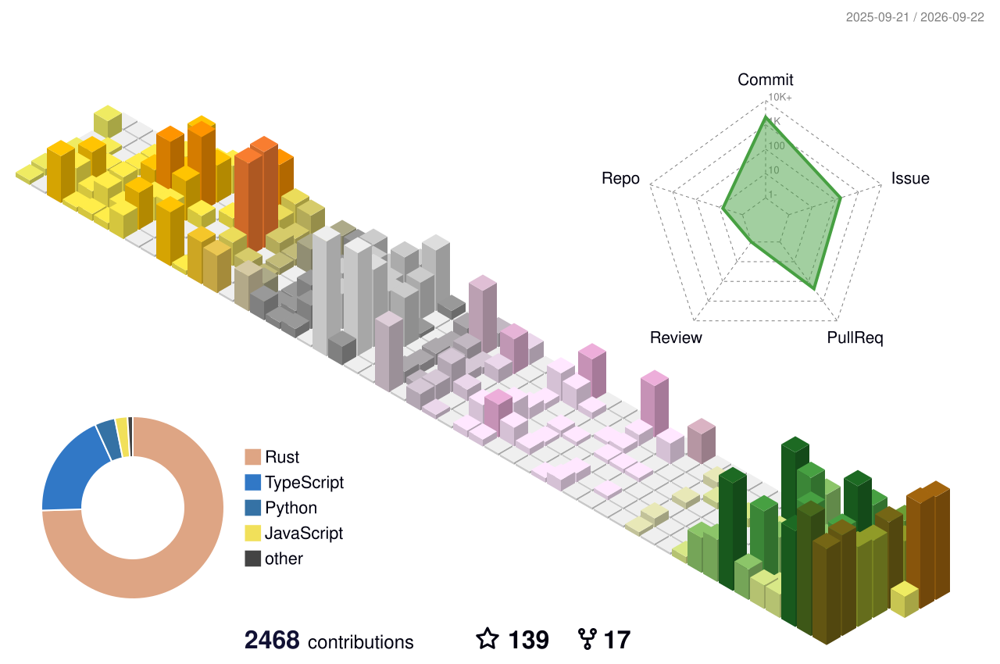

<details>
<summary>Click here for detailed stats!</summary>

<!--START_SECTION:waka-->


**🐱 My GitHub Data** 

> 📦 507.7 kB Used in GitHub's Storage 
 > 
> 🏆 959 Contributions in the Year 2026
 > 
> 🚫 Not Opted to Hire
 > 
> 📜 20 Public Repositories 
 > 
> 🔑 36 Private Repositories 
 > 
**I'm a Night 🦉** 

```text
🌞 Morning                1113 commits        █░░░░░░░░░░░░░░░░░░░░░░░░   05.74 % 
🌆 Daytime                7895 commits        ██████████░░░░░░░░░░░░░░░   40.73 % 
🌃 Evening                6480 commits        ████████░░░░░░░░░░░░░░░░░   33.43 % 
🌙 Night                  3896 commits        █████░░░░░░░░░░░░░░░░░░░░   20.10 % 
```


📊 **This Week I Spent My Time On** 

```text
💬 Programming Languages: 
Python                   11 hrs 7 mins       ███████████░░░░░░░░░░░░░░   42.53 % 
Other                    9 hrs 46 mins       █████████░░░░░░░░░░░░░░░░   37.35 % 
Bash                     3 hrs 58 mins       ████░░░░░░░░░░░░░░░░░░░░░   15.20 % 
JavaScript               51 mins             █░░░░░░░░░░░░░░░░░░░░░░░░   03.27 % 
Text                     17 mins             ░░░░░░░░░░░░░░░░░░░░░░░░░   01.13 % 

🔥 Editors: 
VS Code                  23 hrs 41 mins      ███████████████████████░░   90.96 % 
Codex CLI                2 hrs 21 mins       ██░░░░░░░░░░░░░░░░░░░░░░░   09.04 % 

💻 Operating System: 
Linux                    26 hrs 2 mins       █████████████████████████   100.00 % 
```

🤖 **AI Coding This Week** 

```text
⏱ AI Coding Time: 5 hrs 2 mins (19.33%)

✍️ 920 lines written by AI, 22,072 lines written by hand (4.0% AI-written)

🔤 55,919,871 Input Tokens, 495,945 Output Tokens

💵 $72.11 Estimated AI Cost This Week

🧠 5 AI Sessions, 18 AI Prompts

GPT                      332 lines           █████████████████████████   100.00 % 

🔎 AI Coding Insights:
🧑‍💻 Mostly Hands-On — 4.0% of written lines came from AI
📝 Concise Prompter — average 487 characters per prompt
🔁 Iterative Prompter — average 4 prompts per session
🔍 Hands-On Reviewer — 97.07% of changed lines were hand-edited
```


<!--END_SECTION:waka-->
</details>
