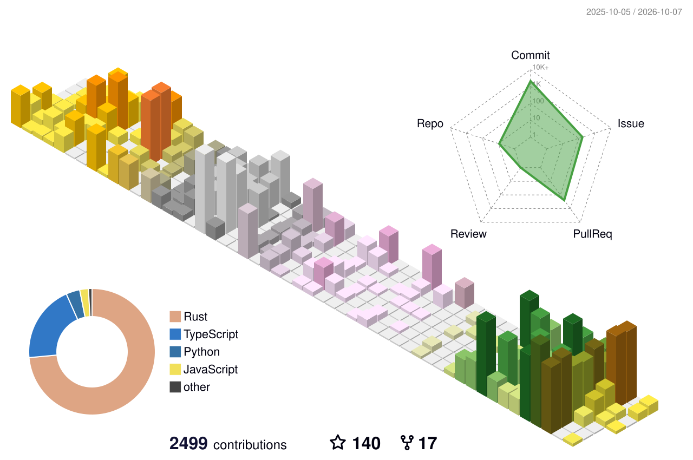

<details>
<summary>Click here for detailed stats!</summary>

<!--START_SECTION:waka-->


**🐱 My GitHub Data** 

> 📦 514.6 kB Used in GitHub's Storage 
 > 
> 🏆 1,910 Contributions in the Year 2026
 > 
> 🚫 Not Opted to Hire
 > 
> 📜 25 Public Repositories 
 > 
> 🔑 36 Private Repositories 
 > 
**I'm a Night 🦉** 

```text
🌞 Morning                1511 commits        █░░░░░░░░░░░░░░░░░░░░░░░░   05.67 % 
🌆 Daytime                10719 commits       ██████████░░░░░░░░░░░░░░░   40.26 % 
🌃 Evening                9429 commits        █████████░░░░░░░░░░░░░░░░   35.41 % 
🌙 Night                  4967 commits        █████░░░░░░░░░░░░░░░░░░░░   18.65 % 
```


📊 **This Week I Spent My Time On** 

```text
💬 Programming Languages: 
Other                    5 hrs 32 mins       ████████████░░░░░░░░░░░░░   48.91 % 
Python                   1 hr 56 mins        ████░░░░░░░░░░░░░░░░░░░░░   17.13 % 
Bash                     1 hr 51 mins        ████░░░░░░░░░░░░░░░░░░░░░   16.44 % 
TypeScript               53 mins             ██░░░░░░░░░░░░░░░░░░░░░░░   07.92 % 
Markdown                 25 mins             █░░░░░░░░░░░░░░░░░░░░░░░░   03.68 % 

🔥 Editors: 
VS Code                  11 hrs 18 mins      █████████████████████████   99.94 % 
Claude Code              0 secs              ░░░░░░░░░░░░░░░░░░░░░░░░░   00.06 % 

💻 Operating System: 
Linux                    9 hrs 36 mins       █████████████████████░░░░   84.91 % 
WSL                      1 hr 42 mins        ████░░░░░░░░░░░░░░░░░░░░░   15.09 % 
```

🤖 **AI Coding This Week** 

```text
⏱ AI Coding Time: 3 hrs 14 mins (28.56%)

✍️ 540 lines written by AI, 5,520 lines written by hand (8.91% AI-written)

🔤 45,798,310 Input Tokens, 342,192 Output Tokens

💵 $245.43 Estimated AI Cost This Week

🧠 21 AI Sessions, 55 AI Prompts

Pi                       540 lines           ███████████████████████░░   91.22 % 
GPT                      52 lines            ██░░░░░░░░░░░░░░░░░░░░░░░   08.78 % 

🔎 AI Coding Insights:
🧑‍💻 Mostly Hands-On — 8.91% of written lines came from AI
📝 Concise Prompter — average 159 characters per prompt
🔁 Iterative Prompter — average 3 prompts per session
🔍 Hands-On Reviewer — 91.54% of changed lines were hand-edited
```


<!--END_SECTION:waka-->
</details>
