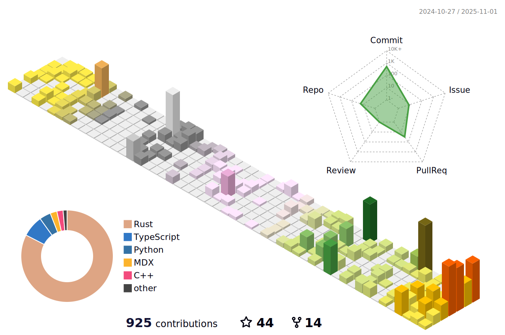

<details>
<summary>Click here for detailed stats!</summary>

<!--START_SECTION:waka-->


**🐱 My GitHub Data** 

> 📦 432.3 kB Used in GitHub's Storage 
 > 
> 🏆 87 Contributions in the Year 2025
 > 
> 🚫 Not Opted to Hire
 > 
> 📜 40 Public Repositories 
 > 
> 🔑 33 Private Repositories 
 > 
**I'm an Early 🐤** 

```text
🌞 Morning                813 commits         ██░░░░░░░░░░░░░░░░░░░░░░░   08.75 % 
🌆 Daytime                4162 commits        ███████████░░░░░░░░░░░░░░   44.77 % 
🌃 Evening                2127 commits        ██████░░░░░░░░░░░░░░░░░░░   22.88 % 
🌙 Night                  2194 commits        ██████░░░░░░░░░░░░░░░░░░░   23.60 % 
```


📊 **This Week I Spent My Time On** 

```text
💬 Programming Languages: 
Python                   9 hrs 59 mins       ███████░░░░░░░░░░░░░░░░░░   27.76 % 
CLI                      5 hrs 30 mins       ████░░░░░░░░░░░░░░░░░░░░░   15.29 % 
C++                      5 hrs 13 mins       ████░░░░░░░░░░░░░░░░░░░░░   14.55 % 
JSON                     3 hrs 30 mins       ██░░░░░░░░░░░░░░░░░░░░░░░   09.74 % 
Other                    3 hrs 20 mins       ██░░░░░░░░░░░░░░░░░░░░░░░   09.30 % 

🔥 Editors: 
VS Code                  20 hrs 20 mins      ██████████████░░░░░░░░░░░   56.54 % 
Ghostty                  5 hrs 30 mins       ████░░░░░░░░░░░░░░░░░░░░░   15.29 % 
Zotero                   3 hrs 16 mins       ██░░░░░░░░░░░░░░░░░░░░░░░   09.12 % 
NetEaseMusic             3 hrs 6 mins        ██░░░░░░░░░░░░░░░░░░░░░░░   08.63 % 
Telegram                 2 hrs 54 mins       ██░░░░░░░░░░░░░░░░░░░░░░░   08.09 % 

💻 Operating System: 
Mac                      15 hrs 38 mins      ███████████░░░░░░░░░░░░░░   43.46 % 
Linux                    14 hrs 14 mins      ██████████░░░░░░░░░░░░░░░   39.60 % 
WSL                      6 hrs 5 mins        ████░░░░░░░░░░░░░░░░░░░░░   16.94 % 
```


<!--END_SECTION:waka-->
</details>
